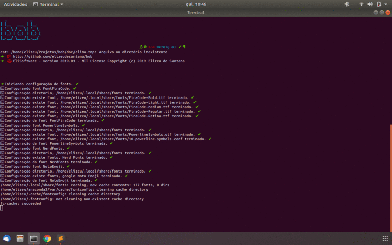
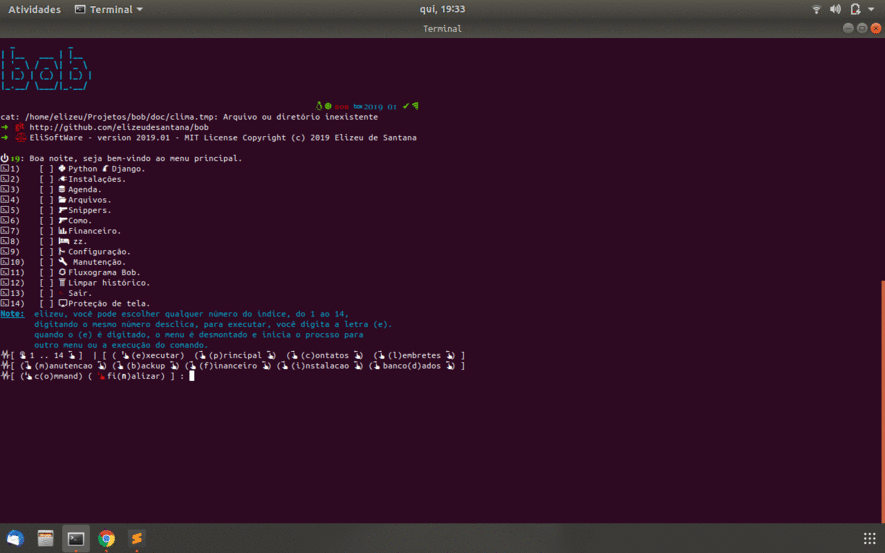

# bob (V 2019.01) 

> Este repository, contem scripts que juntos formam o sistema `bob`.
Que é um sitema de controle para instalação de programas no sistema linux ubuntu, este nasceu da necessidade
de instalar programas e configurações sempre que instalava o sistema linux (coisas pra fazer), então surgiu o 
prototipo de um script para o auxilio no startup do SO.

[![NPM Version][npm-image]][npm-url]
[![Build Status][travis-image]][travis-url]
[![Downloads Stats][npm-downloads]][npm-url]


Correndo ./bob_i.sh



# Bob.sh
Este script é o principal todos os outros são auxiliares nas funções.  
O sistema tem uma organização MVC, e um menu quantico, as divisões das funções entre os arquivos segue
este padrão, o controler que é realizado por bob, os modulos lib's e as views que contém o que impresso
na tela.



Os scripts estão distribuidos como segue.  

1. **Scripts** -  Lista de todos os scripts.  E suas respectivas descrições: 
	* **bob_i** - Inicializa o sistema, instalando algumas depêndencias e fontes além de configurar o `bob`.
	* **/bin/bob** - Sistema de fluxo e controle
	* **/lib/bob_util** - Script contendo a Classe_Bob, com todas as funcionalidades, do sistema.
	* **/lib/bob_bancodados** - Script de controle para instalação e configuração de Banco de Dados relacional.
	* **/lib/bob_financeiro** - Script que trabalha definições cryptmoedas bolsa de valores, etc.
	* **/lib/bob_financeiroDB** - Auxiliar do script financeiro.
	* **/lib/bob_instalacao** - Script de Instalações e configurações, Midias, editores, Desenvolvimento, etc.
	* **/lib/bob_lembra** - Agenda e lembretes.
	* **/lib/bob_lembra_montante** - Auxiliar lembra.
	* **/lib/bob_manutencao** - Manutenção, monitoramento e relatórios.
	* **/lib/bob_programas** - Auxiliar instalação.
	* **/lib/bob_python** - Envirioments and python django.
	* **/lib/bob_servidor** - Auxiliar instalação.
	* **/lib/bob_shellfonts** - Auxiliar instalação.
	* **/lib/bob_texto** - Trabalhos com texto, muito sedddddddd.....
	* **/lib/bob_util_conf** - Configuraçãoes do sistema.
	* **/lib/bob_util_montante** - Auxiliar no util.
	* **/lib/bob_cht** - Ferramenta externa.
	* **/lib/bob_fluxograma** - Fluxograma do funcionamento do sistema.
	

2. **Sistemas adicionais inseridos em `bob`** - credits.

### bob_zzfuncao.sh
[funcoeszz](https://funcoeszz.net/)
### cht.sh
[cht.sh](http://cht.sh)
### datas
[datas](https://thobias.org/datas/index.html)
### Gogh
[Gogh](https://github.com/Mayccoll/Gogh)

## Installation

OS X & Linux:

```sh
cd ~ && mkdir bob && cd bob
clone https://github.com/elizeudesantana/bob.git tmp && mv tmp/.git . && rm -fr tmp && git reset --hard
```

## Exemplo de uso

Implementar

_Para mais exemplos, consulte a [Wiki][wiki]._ 

## Configuração para Desenvolvimento

Testes e Debug sendo codificado.

```sh
Em andamento
```

## Histórico de lançamentos

* 2019.01
	* Versão do sistema
* 1.0.0
    * Versão dos scripts

## Meta

Elizeu de Santana – [@elizeudesantan1](https://twitter.com/@elizeudesantan1) – elizeudesantana@hotmail.com

Distribuído sob a licença MIT. Veja `LICENSE` para mais informações.

[https://github.com/elizeudesantana/bob](https://github.com/elizeudesantana/bob)

## Contributing


[npm-image]: https://img.shields.io/npm/v/datadog-metrics.svg?style=flat-square
[npm-url]: https://npmjs.org/package/datadog-metrics
[npm-downloads]: https://img.shields.io/npm/dm/datadog-metrics.svg?style=flat-square
[travis-image]: https://img.shields.io/travis/dbader/node-datadog-metrics/master.svg?style=flat-square
[travis-url]: https://travis-ci.org/dbader/node-datadog-metrics
[wiki]: https://github.com/seunome/seuprojeto/wiki